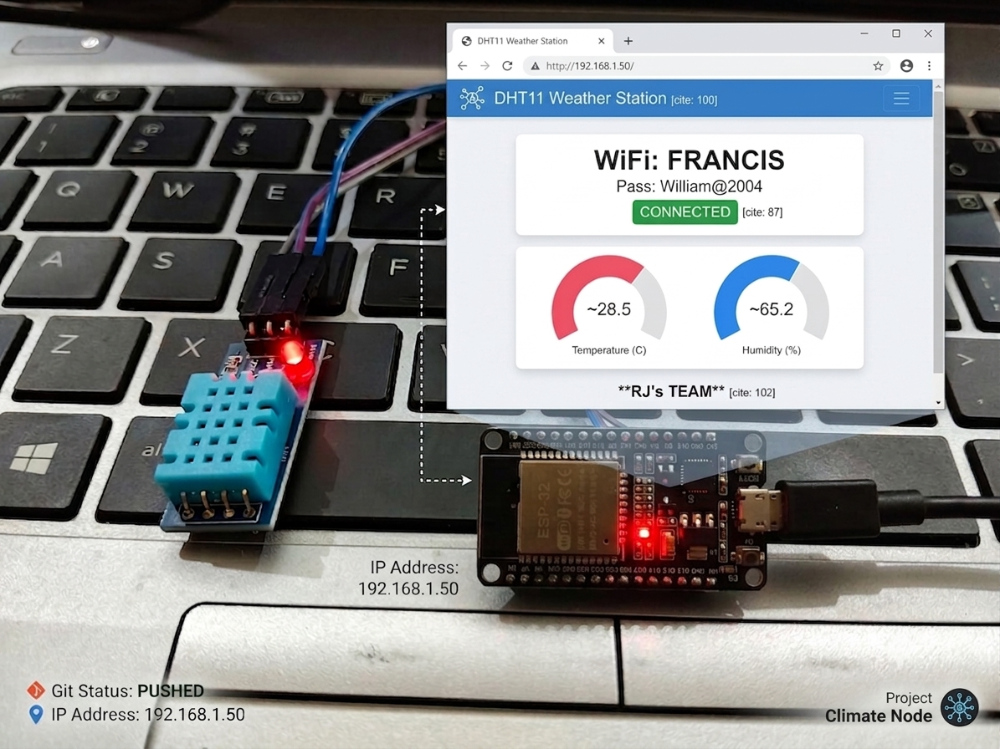

# 🌍 ClimateNode

**ClimateNode** is a lightweight, real-time weather station built with an ESP32 microcontroller and a DHT11 sensor. It hosts a standalone local web server that generates an interactive dashboard to monitor temperature and humidity right from your browser.

---

## 🚀 Live Dashboard Preview

---

## ✨ Features

* **Real-Time Monitoring:** Accurate temperature (°C) and humidity (%) readings.
* **Standalone Web Server:** The ESP32 handles HTML, CSS, and JS delivery internally—no external hosting required.
* **Interactive UI:** Utilizes **Chart.js** via CDN to render dynamic, responsive doughnut gauges.
* **Plug & Play:** Configurable WiFi credentials for rapid deployment on any local network.

## 🛠️ Hardware Requirements

* **ESP32** Development Board
* **DHT11** Temperature & Humidity Sensor
* **Jumper Wires**

## ⚙️ Getting Started

1.  **Hardware Wiring**
    * `VCC` (DHT11) ➔ `3V3` (ESP32)
    * `GND` (DHT11) ➔ `GND` (ESP32)
    * `DATA` (DHT11) ➔ `GPIO 4` (ESP32)

2.  **Software Setup**
    * Open `RJ's ESP32 CODE.ino` in the Arduino IDE.
    * Go to **Sketch > Include Library > Manage Libraries** and install the **DHT sensor library** (by Adafruit) and the **Adafruit Unified Sensor** library.
    * Update the `ssid` and `password` variables at the top of the file with your local WiFi credentials.

3.  **Flash & Run**
    * Select your ESP32 board and COM port in the Arduino IDE.
    * Click **Upload**.
    * Open the Serial Monitor (set to 115200 baud).
    * Press the `EN` (Reset) button on your ESP32. 
    * Copy the local IP Address displayed in the monitor and paste it into any web browser connected to the same network.

---
*Developed by RJ's TEAM*
